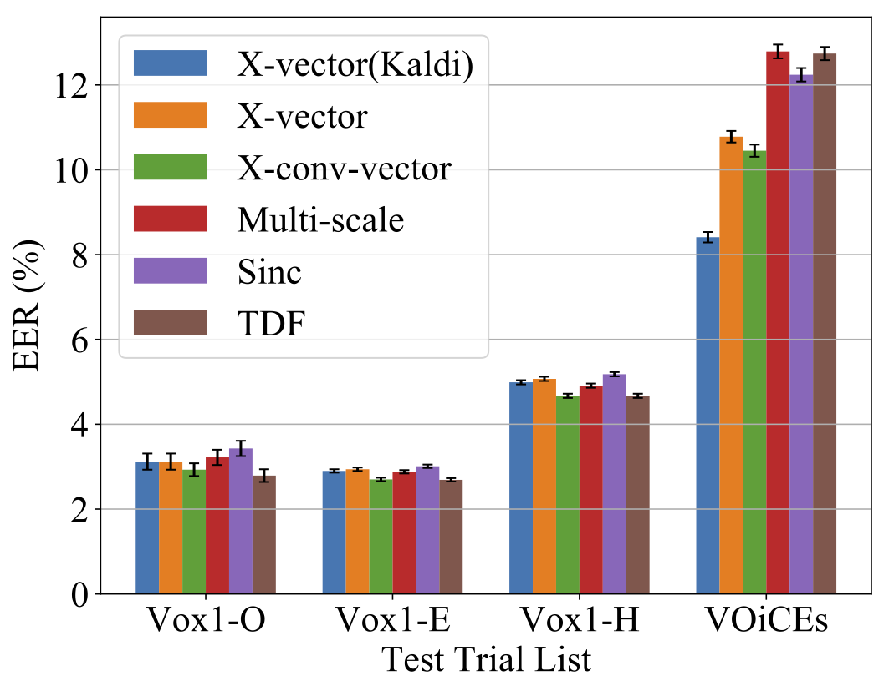
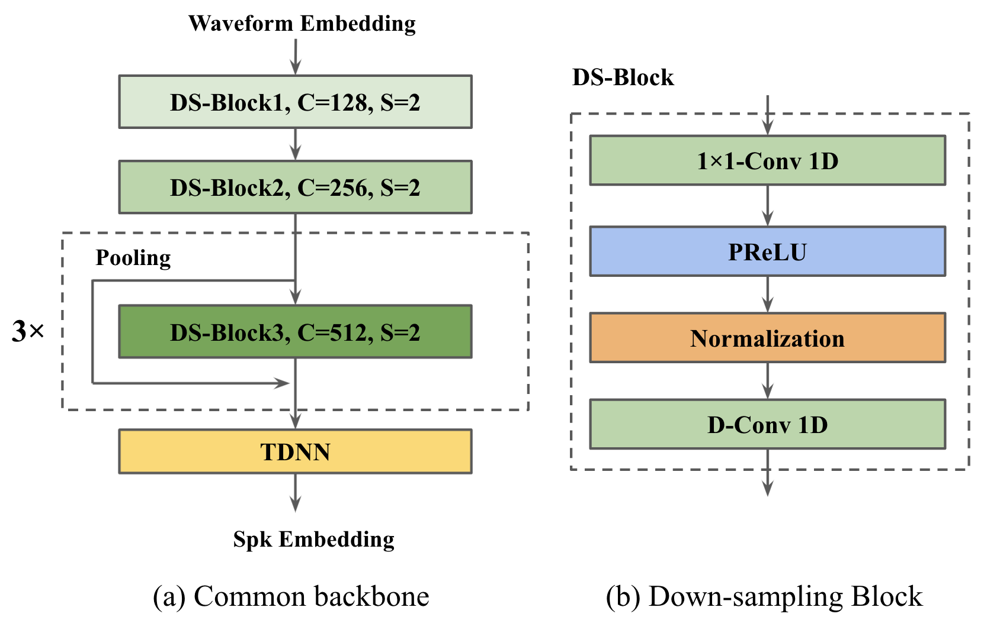

# A study of the robustness of raw waveform based speaker embeddings under mismatched conditions

Code base for "A study of the robustness of raw waveform based speaker embeddings under mismatched conditions" [https://arxiv.org/abs/2110.04265]. Pretrained model [link](https://drive.google.com/file/d/1FFiv8a5r47h74g-HTShYVEUkZEc_JKX8/view?usp=sharing): TDF-Ana-VD-ECAPA-TDNN. You can use this model to run inference, results are shown in the table below.

## Introduction

Waveform based models are notorious for being less robust in speaker recognition compared to spectral based methods. It's overwhelming for the neural networks to learn meaningful representations from such densely sampled data from scratch. There are two main strategies in prior works:
* Parametric learnable filterbanks, introduce inductive bias into the filterbank learning process, such as SincNet, LEAF etc.
* Non-parametric learnable filterbanks with regularizations, such as Gabor initialization, multi-scale analysis, learnable compression functions and complex convolution.

Even with these strategies, we still observe a performance degrade in channel mismatch scenario:
<p align="center"></p>

In the above experiments, we compare different filterbank frontend with a common backbone (due to page limits, we didn't have space for this image), it consists of (1) downsampling blocks which maps raw waveform to time pseudo-frequency representation and (2) classification backbone, such as TDNN or ECAPA-TDNN:

<p align="center"></p>

In this project, we propose two strategies to alleviate this problem, one is to introduce analyticity and the other is to apply variational dropout. 
 
## Requirements
apex \
kaldi \
pytorch \
kaldi_python_io \
matplotlib \
tqdm

## Usage

### Step 0: data preparation

Training: VoxCeleb2 dev + 1M MUSAN aug data. \
In-domian evaluation: VoxCeleb 1 \
Out-of-domian evaluation: VOiCEs

### Step 1: feature extraction
In our experiment, we applied a filterbank of 30 to extract waveform embeddings.

```
bash run_features.sh
```

### Step 2: training
First edit ```run.sh``` file to change training configurations, then:
```
bash run.sh
```

### Step 3: evaluation on VoxCeleb test and VOiCEs 


```
bash run_plda.sh 0
```

### Step 4: Adaptive score normalization

Please see ```snorm.ipynb```.

## Results

 Update to the paper: we replace the original TDNN with [ECAPA-TDNN (denoted as ECAPA)](https://arxiv.org/abs/2005.07143) ([implementation](https://github.com/lawlict/ECAPA-TDNN), here we also follow A.2 model.) Here, we use log mel with 30 mel bins instead of 80 MFCCs in the original paper, which may cause this worse result. Also, we did not apply adaptive score norm (will be updated later), various data aug or cyclic lr with Adam. Results are based on cosine score, values in the table: EER (0.01 minDCF), interestingly, PLDA score is a little bit worse. Other details: we use 512 as embedding dimension.

| Frontend  |Backbone   |Vox1-O    | Vox1-E   |Vox1-H    | VOiCEs   |
|-----------|-----------|----------|----------|----------|----------|
| MFCC*     | Vanilla   |2.26/0.256|2.37/0.279|4.14/0.408|6.79/0.553|
| MFCC      |ECAPA-C512 |1.74/0.167|1.76/0.186|3.01/0.272|6.61/0.461|
| MFCC      |ECAPA-C1024|1.38/0.146|1.51/0.152|2.7/0.254 |6.60/0.427|
| TDF-H-VD* | Vanilla   |1.99/0.266|2.26/0.253|3.93/0.385|7.40/0.633|
| TDF-H-VD#  |ECAPA-C512 |1.6 /0.154|1.66/0.173|2.86 /0.26|7.95/0.582|

(*: Results shown in paper. #: provided pretrained model) \
As can bee seen, although in-domain results are better, the mismatch still exists in out-of-domain data.

## Prior works

[1] Zhu, G., Jiang, F., Duan, Z. (2021) Y-Vector: Multiscale Waveform Encoder for Speaker Embedding. Proc. Interspeech 2021, 96-100, doi: 10.21437/Interspeech.2021-1707 (Code:[Y-vector](https://github.com/gzhu06/Y-vector))

## Note
This code is written roughly in 2020 (and still based on Kaldi!), it's recommended for baseline comparison or demonstration. SpeechBrain is a better choice to develop speaker embeddings.
